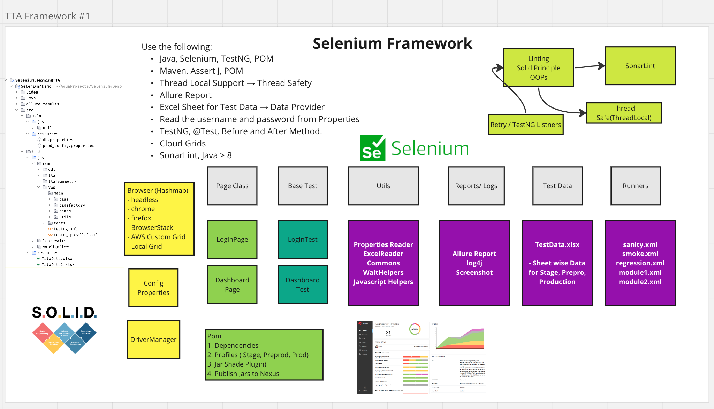
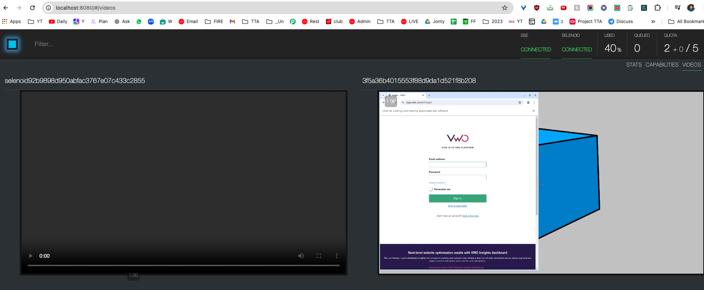

# Selenium Automation Framework(with Java)
- Author - Ashutosh
- Selenium Code

- Java, Selenium, TestNG
- Maven, AssertJ, POM
- Thread Local Support → Thread Safety
- Allure Report
- Excel Sheet for Test Data → Data Provider
- Read the username and password from Properties-
- TestNG, @Test, Before and After Method.
- Cloud Grids - Selenoid Docker integration
- SonarLint, Java > 8
- Run Local and on Selenoid Integration

`mvn test -Dsurefire.suiteXmlFiles=testng.xml`

### Seleniod - Docker Grid Running
- Selenoid is a powerful tool for running Selenium tests in Docker containers.
- which can help you manage and scale your test automation infrastructure more efficiently.

https://private-user-images.githubusercontent.com/1409610/339324110-1bd39751-94e8-4f46-91e4-fd79269f6ee6.mp4?jwt=eyJ0eXAiOiJKV1QiLCJhbGciOiJIUzI1NiJ9.eyJpc3MiOiJnaXRodWIuY29tIiwiYXVkIjoicmF3LmdpdGh1YnVzZXJjb250ZW50LmNvbSIsImtleSI6ImtleTUiLCJleHAiOjE3NTg1NTI4OTUsIm5iZiI6MTc1ODU1MjU5NSwicGF0aCI6Ii8xNDA5NjEwLzMzOTMyNDExMC0xYmQzOTc1MS05NGU4LTRmNDYtOTFlNC1mZDc5MjY5ZjZlZTYubXA0P1gtQW16LUFsZ29yaXRobT1BV1M0LUhNQUMtU0hBMjU2JlgtQW16LUNyZWRlbnRpYWw9QUtJQVZDT0RZTFNBNTNQUUs0WkElMkYyMDI1MDkyMiUyRnVzLWVhc3QtMSUyRnMzJTJGYXdzNF9yZXF1ZXN0JlgtQW16LURhdGU9MjAyNTA5MjJUMTQ0OTU1WiZYLUFtei1FeHBpcmVzPTMwMCZYLUFtei1TaWduYXR1cmU9MDU1MjQ0NDFlMDdjMjkwMWVmNzgxOGQ3YmI5MWM4OTFlZDlhZTg1ODdiM2U1YmU1NmU4ZGE5ZjhkNmM0ZGFjMCZYLUFtei1TaWduZWRIZWFkZXJzPWhvc3QifQ.2jAC12UQFiWJBMy_JFxPpT71Xufurs3wEbgCQ73lSSw

https://github.com/ashu2305m/ATB12xSeleniumAdvanceFramework

